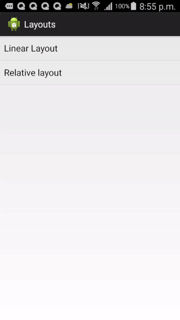

## LinearLayout and RelativeLayout in Android

This section contains two layout files for an Android app, one using `LinearLayout` and the other using `RelativeLayout`.




### LinearLayout
The `linear_layout.xml` file uses `LinearLayout` with a `vertical orientation`. The height of the inner views is set to `wrap_content`, except for the `EditText` used for message input, which has a height of `0dp` and a weight of `1`.

```
android:layout_height="0dp"
android:layout_weight="1"
```


```xml
<?xml version="1.0" encoding="utf-8"?>
<LinearLayout xmlns:android="http://schemas.android.com/apk/res/android"
    android:layout_width="fill_parent"
    android:layout_height="fill_parent"
    android:background="@color/dodgerblue"
    android:orientation="vertical"
    android:paddingLeft="16dp"
    android:paddingRight="16dp" >

    <EditText
        android:layout_width="fill_parent"
        android:layout_height="wrap_content"
        android:background="@color/azure"
        android:hint="@string/to" />

    <EditText
        android:layout_width="fill_parent"
        android:layout_height="wrap_content"
        android:background="@color/pink"
        android:hint="@string/subject" />

    <EditText
        android:layout_width="fill_parent"
        android:layout_height="0dp"
        android:layout_weight="1"
        android:background="@color/cyan"
        android:gravity="top"
        android:hint="@string/message" />

    <Button
        android:layout_width="100dp"
        android:layout_height="wrap_content"
        android:layout_gravity="right"
        android:background="@color/red"
        android:text="@string/send" />

</LinearLayout>
```


and the version in ```RelativeLayout``` gives:

```xml

<?xml version="1.0" encoding="utf-8"?>
<RelativeLayout xmlns:android="http://schemas.android.com/apk/res/android"
    android:layout_width="match_parent"
    android:layout_height="match_parent"
    android:background="@color/dodgerblue"
    android:padding="16dp" >

    <EditText
        android:id="@+id/name"
        android:layout_width="fill_parent"
        android:layout_height="wrap_content"
        android:background="@color/pink"
        android:hint="@string/reminder" />

    <EditText
        android:id="@+id/dates"
        android:layout_width="0dp"
        android:layout_height="wrap_content"
        android:layout_alignParentLeft="true"
        android:layout_below="@id/name"
        android:layout_toLeftOf="@+id/times"
        android:background="@color/darkolivegreen"
        android:hint="@string/date" />

    <EditText
        android:id="@id/times"
        android:layout_width="96dp"
        android:layout_height="wrap_content"
        android:layout_alignParentRight="true"
        android:layout_below="@id/name"
        android:background="@color/beige"
        android:hint="@string/time" />

    <Button
        android:layout_width="96dp"
        android:layout_height="wrap_content"
        android:layout_alignParentRight="true"
        android:layout_below="@id/times"
        android:background="@color/greenyellow"
        android:text="@string/done" />

</RelativeLayout>
```


The design in the LinearLayout above was updated to get this.


The xml for this updated version looks like this


See if you can implement an improved version of the above design but this time, 
using a ConstraintLayout combined with a ScrollView, a RelativeLayout, and a LinearLayout if all needed. 
Your final result should look like this

 

